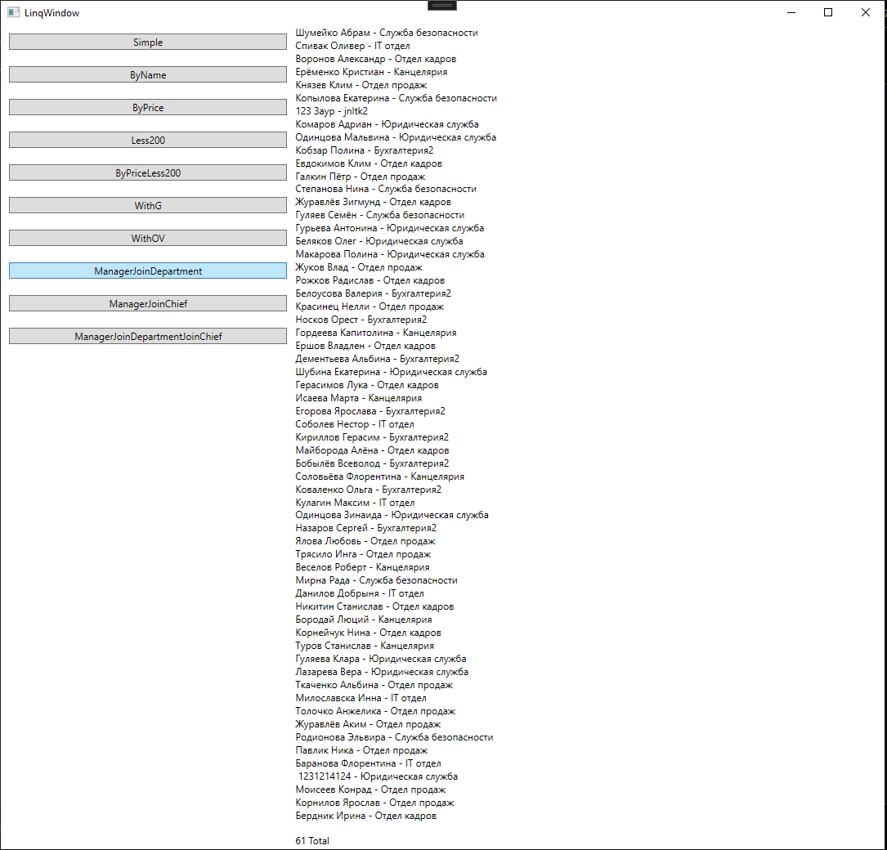
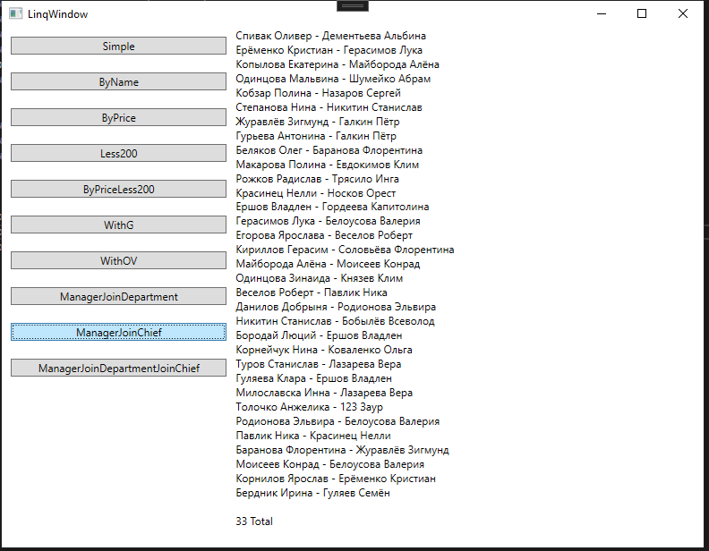
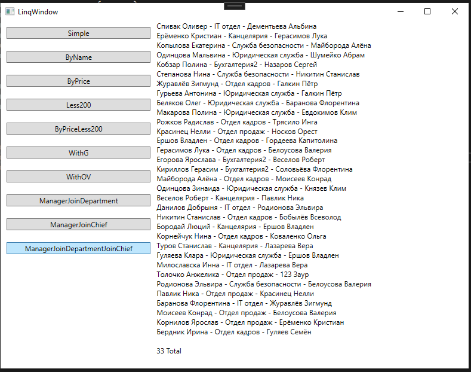

``` 
/* Д.З. Вывести сводные данные по продажам: 
 *   №п.п - название товара - кол-во проданных шт - сумма продажи
 * фильтр - за "сегодня" 
 * (можно без ORM, использовать Reader)
 */
```

фильтр - за "сегодня" я понял как построчный фильтр WHERE



